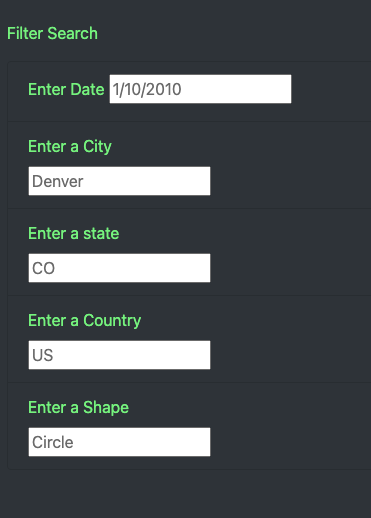
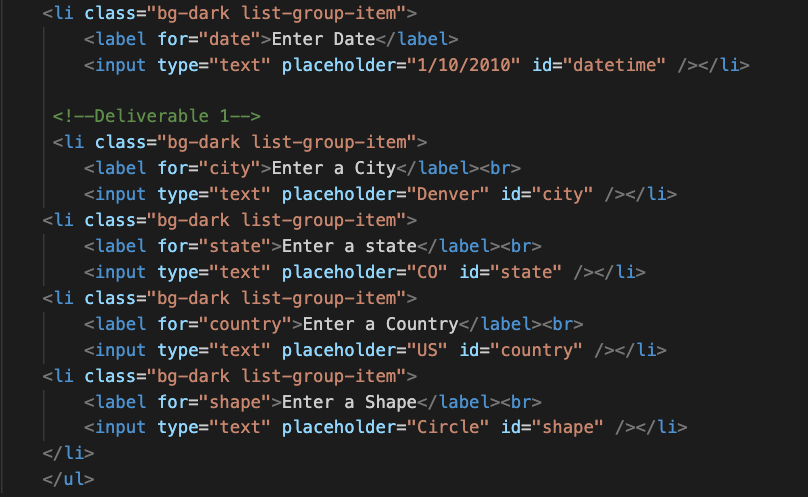
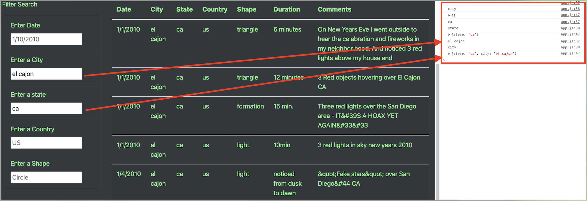

# UFO-Sightings
Javascript

## Overview

This project primarily uses HTML and JavaScript to create an interactive webpage that takes information entered by the user - properties in the Document Object Model (DOM) - to parse and return back queries from the dictionary on UFO sightings.  

**View the page at:**  https://halesoysters.github.io/

## Results

Users enter search criteria such as city, state or shape into the webpage.  The following HTML code creates the container that holds the list item class, or attribute, that users will type into:

   

The JavaScript file `app` serves as the intermediary between the data.js file and what users actually see after typing their query.  First, a series of filters stored as a variable named `filters` were created to take the data entered by the user and iterate through the data and return the value that corresponds with the id as demonstrated on the following console log:

 

## Summary

One obvious drawback is that the data is case sensitive.  Given more time, I could have used the Python function `str.lower()` to transform the string data being entered by users into lowercase.  
